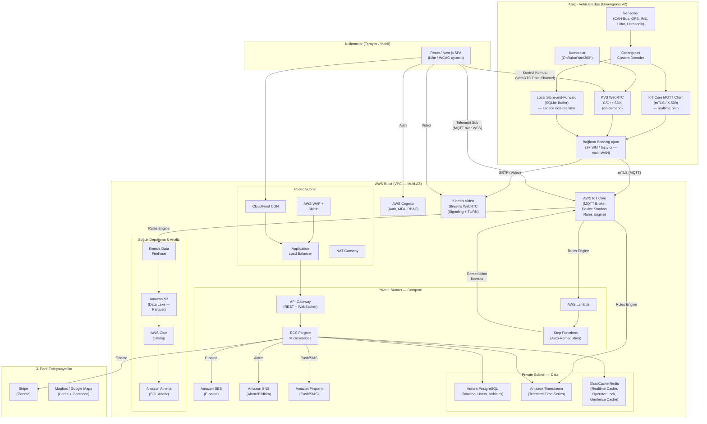
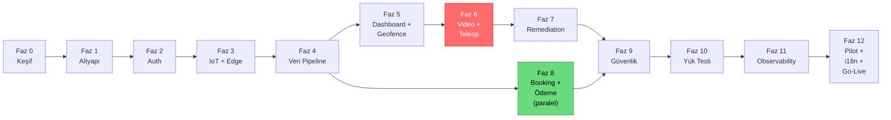

# JOPPILOT - Fleet Management & Remote Control System 

## Bölüm A: Sistem Özeti

Kurulacak platform **üç ana yetenek bloğundan** oluşur:

1. **Filo Yönetimi & Diyagnostik:** Araçların uzaktan izlenmesi, sensör/telemetri verilerinin toplanması, tüm verilerin loglanması, çözülebilir hataların otomatik düzeltilmesi.
2. **Teleoperasyon (Uzaktan Kontrol):** Otonom hareket eden araçların kamera ve sensör verilerinin **gerçek zamana en yakın** şekilde izlenmesi ve gerektiğinde operatör tarafından uzaktan müdahale/kontrol edilmesi.
3. **Booking (Kiralama) Sistemi:** Müşteri kiralama taleplerinin alınması, kontrolü, loglanması, düzenlenmesi, ödeme entegrasyonu ve araç müsaitliğiyle ilişkilendirilmesi.

## Bölüm B: Kapsam 

- Filo izleme, diyagnostik, loglama, otomatik hata çözme (auto-remediation).
- Teleoperasyon **altyapısı**: video taşıma, kontrol kanalı, oturum yönetimi, failsafe.
- Booking (kiralama) sistemi + ödeme entegrasyonu.
- Bulut altyapısı, güvenlik, gözlemlenebilirlik, ölçek.
- i18n/l10n (çoklu dil, para birimi, timezone).
- API dokümantasyonu ve versiyonlama.
- Geofencing (operasyon alanı sınırlaması).

## Bölüm C: Mimari Genel Bakış



## Bölüm D: Teknoloji / AWS Servis Seçimleri ve Gerekçeleri

| İhtiyaç | Seçilen Servis | Gerekçe |
|---|---|---|
| **Kimlik doğrulama** | **Amazon Cognito** | Yönetilen kullanıcı havuzu; self-signup kapatılarak davet usulü kayıt; MFA; JWT ile RBAC. |
| **Araç bağlantı omurgası** | **AWS IoT Core + IoT Greengrass V2** | X.509 sertifika (mTLS), MQTT, device shadow. Edge'de yerel filtreleme, CAN decode ve store-and-forward. |
| **Araç bağlantı dayanıklılığı** | **Çok-modem / Bonded Cellular** (2+ SIM) + edge bonding ajanı | Tek hücresel bağlantı teleoperasyonu kırar. Çoklu taşıyıcı agregasyonu boşlukları kapatır. |
| **Filo yazılım yönetimi / OTA** | **Greengrass Deployments + AWS IoT Jobs** | 200 edge cihazına sürümlü güncelleme; canary rollout + otomatik rollback. |
| **Telemetri zaman serisi** | **Amazon Timestream (for LiveAnalytics)** | Yönetilen time-series DB; otomatik retention. *Region uygunluğu kontrol edilmeli; alternatif: TimescaleDB-on-RDS.* |
| **Ham veri / data lake** | **S3 + Glue Catalog + Athena** | Ucuz, limitsiz, sorgulanabilir arşiv; Parquet formatı. |
| **İlişkisel veri** | **Amazon Aurora PostgreSQL** | ACID; booking state machine + takvim çakışma koruması; failover + read replica. |
| **Gerçek zamanlı cache** | **Amazon ElastiCache (Redis)** | Sub-ms okuma; tek-operatör kilitleme; geofence polygon cache. |
| **Düşük gecikmeli video** | **Kinesis Video Streams WebRTC** *(POC ile doğrulanacak)* | Sub-second gecikme, SRTP şifreli. **Video on-demand:** yalnızca aktif oturumda. |
| **Kontrol komutu** | **WebRTC Data Channel** (birincil) + **IoT Core MQTT QoS1** (yedek) | Data Channel < 50ms. MQTT: güvenilir yedek kanal. |
| **Backend servisleri** | **ECS Fargate** | Kalıcı bağlantılar, mikroservisler, sunucusuz otomatik ölçek. |
| **API katmanı** | **API Gateway (REST)** + **IoT Core MQTT-over-WSS** | REST: yetkili CRUD. Canlı telemetri: MQTT-over-WSS. |
| **Otomatik hata çözme** | **IoT Rules → Lambda → Step Functions** | Kademeli remediation iş akışı → eskalasyon. |
| **Frontend** | **React/Next.js SPA + CloudFront** | CDN, i18n (next-intl/react-i18next), WCAG 2.1 AA uyumlu. |
| **Ödeme** | **Stripe** (veya iyzico/Paytr) | PCI DSS uyumlu; multi-currency, refund, recurring billing. |
| **Bildirim** | **SES** + **SNS** + **Pinpoint** | E-posta + SMS + push notification. |
| **Harita & Geofencing** | **Mapbox GL JS** / **Google Maps** + opsiyonel **Amazon Location Service** | Canlı araç takibi + geofence polygon. |
| **IaC** | **Terraform** veya **AWS CDK** | Tekrarlanabilir altyapı; dev/staging/prod. |
| **Güvenlik** | **WAF, Shield, GuardDuty, Security Hub, KMS, Secrets Manager, CloudTrail** | Katmanlı savunma. |
| **Ağ erişim kısıtlama** | **AWS Client VPN** veya **IP bazlı SG** | Teleoperatör erişimini kurumsal ağ/VPN ile sınırlandırma. |
| **API Dokümantasyonu** | **OpenAPI 3.1 (Swagger)** + **Redoc** | Versiyonlu, etkileşimli API referansı. |

## Bölüm E: Kullanıcı Rolleri (RBAC)

| Rol | Yetkiler |
|---|---|
| **Süper Admin** | Tam yetki: kullanıcı/araç/rol yönetimi, konfigürasyon, acil kontrol. |
| **Filo Yöneticisi** | İzleme, hata raporları. |
| **Teleoperatör** | Canlı izleme + uzaktan sürüş + diyagnostik müdahale. Yalnızca atanmış araçlar. |
| **Booking Görevlisi** | Kiralama taleplerini yönetir, müşteri yönetimi, fiyatlandırma. |
| **Müşteri** | Yalnızca kendi kiralama talepleri, fatura ve geçmiş. |
| **Viewer / Denetçi** | Salt-okunur erişim (audit / compliance). |

## Bölüm F: Araç Durumları (Vehicle States) - `Üzerine Çalışılacak`

```
┌──────────┐    ┌────────────────┐    ┌──────────────┐
│ OFFLINE  │───▶│     ONLINE     │───▶│     IDLE     │
└──────────┘    └──┬─────────┬───┘    └──────┬───────┘
                   │         │               │
                   ▼         │               ▼
               ┌──────────┐  │        ┌───────────────┐
               │ CHARGING │  │        │MISSION_RUNNING│
               └──────────┘  ▼        └──────┬────────┘
                   ┌─────────────┐           ▼           
                   │ MAINTANANCE │    ┌───────────────┐    ┌─────────┐       
                   └─────────────┘    │ TELEOP_ACTIVE │───▶│  ERROR  │
                                      └───────────────┘    └─────────┘                                         
```

## Bölüm G: Faz Faz Proje Planı

### FAZ 0: Keşif, Mimari Tasarım ve Hazırlık
**Süre:** 2-3 Hafta

**Amaç:** Belirsizlikleri kapatmak, mimariyi sabitlemek, geliştirmeye temiz zeminle başlamak.

**Adımlar:**
- **0.1. Detaylı Gereksinim Analizi:** use-case'ler, roller, sensör tipleri, veri hacmi
- **0.2. Araçtan Gelecek Veri Tanımları:** GPS, hız, batarya (V/A/°C/SOC), motor durumu, DTC, IMU, Lidar metadata, kamera, ultrasonik, araç CPU/RAM/Disk, ağ bilgileri.
- **0.3. Uzaktan Kontrol Komut Kataloğu:** Start/Stop Mission, E-Stop, Drive, Turn, Resume Autonomy, Restart Service/Computer/Sensor, Update Config.
- **0.4. Mimari Kararlar (ADR):** veri akış diyagramları ve Architecture Decision Records.
- **0.5. AWS Hesap Yapısı:** AWS Organizations ile multi-account (dev/staging/prod + security/log hesabı).
- **0.6. Bölge Seçimi:** coğrafi yakınlık, gecikme, KVKK/GDPR veri ikametgâhı.
- **0.7. Maliyet Modeli:** filo büyüklüğüyle ölçeklenen kalemler vs. eşzamanlı oturum sayısıyla ölçeklenen kalemler. Kritik: video on-demand olursa egress, filo büyüklüğüyle değil ~5-15 eşzamanlı oturumla sınırlı kalır. Billing alarmları baştan kurulur.
- **0.8. Video Akış Modeli Kararı:** sürekli mi, on-demand mı? **Varsayılan: on-demand.**
- **0.9. Bağlantı Mimarisi Kararı:** tek hücresel mi, çok-modem/bonded cellular mi? Teleop için pratikte çok-modem zorunlu.
- **0.10. Regülasyon ve Fonksiyonel Güvenlik:** ISO 26262, ISO 21448/SOTIF, UNECE R155/R156, yerel mevzuat, sigorta. Otomotiv güvenlik danışmanı.
- **0.11. Servis Uygunluk Teyidi:** Timestream, KVS WebRTC, Greengrass V2 seçilen Region'da uygun mu?
- **0.12. i18n Stratejisi:** hedef pazarlar/diller, para birimi, timezone, birim sistemi, framework seçimi.
- **0.13. Erişilebilirlik Hedefi:** WCAG 2.1 AA uyumluluk, özellikle E-STOP butonu erişilebilirliği.

**Çıktılar:** SRS, mimari diyagram, ADR'ler, maliyet modeli, regülasyon değerlendirmesi, i18n stratejisi.

### FAZ 1: Altyapı Temeli (IaC + CI/CD + Ağ)
**Süre:** 2-3 Hafta (Toplam: Hafta 4-6)

- **1.1. IaC:** Terraform/CDK + S3 backend + DynamoDB state lock.
- **1.2. VPC:** Multi-AZ; public subnet (CloudFront, ALB, NAT); private subnet (ECS, Lambda, Aurora, Timestream, Redis — dış dünyaya kapalı). SG/NACL least-privilege. Client VPN önerilen.
- **1.3. IAM:** least-privilege roller, root kilitli, SCP tanımlı, Secrets Manager + otomatik rotasyon.
- **1.4. KMS:** veri kategorisi başına ayrı anahtar.
- **1.5. CI/CD:** `Lint → Unit Test → SAST → Container Scan (Trivy/ECR) → Docker Build → ECR → ECS Deploy`. Üç ortam: dev/staging/prod.
- **1.6. Gözlemlenebilirlik Başlangıcı:** CloudTrail (Object Lock), CloudWatch Logs + KMS, billing alarmları.

**Tamamlanma Kriteri:** Hello-world servisi otomatik deploy ediliyor; altyapı koddan yeniden oluşturulabiliyor.

### FAZ 2: Kimlik Doğrulama ve Yetkilendirme
**Süre:** 1-1.5 Hafta (Toplam: Hafta 7)

- **2.1. Cognito:** Email+Şifre, self-signup kapalı, AdminCreateUser + SES davet.
- **2.2. Şifre & MFA:** min 12 karakter, geçmiş tekrar engelleme, Admin/Teleoperatör MFA zorunlu (TOTP). Rate limiting + hesap kilitleme (5 başarısız → 30 dk).
- **2.3. RBAC:** Cognito grupları, JWT claim'ler, API Gateway Authorizer + middleware.
- **2.4. Kullanıcı Yönetimi:** davet, rol atama, devre dışı bırakma, kısa ömürlü access token (15 dk) + refresh (7 gün), idle timeout (30 dk), şifre sıfırlama.
- **2.5. Immutable Audit Log:** kritik aksiyonlar S3 Object Lock (WORM) ile korunan ayrı bucket'a yazılır.

**Tamamlanma Kriteri:** Yetkisiz kullanıcı giremiyor; roller izole; MFA çalışıyor; tüm giriş/çıkışlar loglu.

### FAZ 3: Araç Bağlantı Omurgası (IoT Core + Greengrass Edge)
**Süre:** 2-3 Hafta (Toplam: Hafta 8-10)

- **3.1. IoT Core:** MQTT topic hiyerarşisi (`fleet/{vehicleId}/telemetry`, `.../diagnostics`, `.../status`, `.../commands`, `.../commands/response`, `.../alerts`, `.../geofence`).
- **3.2. Cihaz Provizyonu:** X.509 sertifika, mTLS, Fleet Prov — isioning Template, sertifika iptali → anında bağlantı kesme.
- **3.3. Device Shadow:** reported/desired state; `autonomousMode`, `currentSpeed`, `batterySOC`, `errorState`, `operatorId`, `geofenceZoneId`, `softwareVersion`.
- **3.4. Greengrass V2 Edge:** Store-and-Forward (non-realtime veri için sıfır kayıp; **realtime/teleop tamponlanmaz → failsafe**), Custom CAN Decoder, Edge Geofence (bağlantı kopsa bile lokal durdurma), bonded bağlantı katmanı, yerel filtreleme.
- **3.5. Araç Simülatörü:** parametrik Python scripti (araç sa — yısı, frekans, hata enjeksiyonu).
- **3.6. OTA / Filo Yazılım Yönetimi:** Greengrass Deployments + IoT Jobs, canary rollout (1-2 araç → doğrula → yaygınlaştır), otomatik rollback, yazılım sürüm envanteri. UNECE R156 uyumu değerlendirilir.

**Tamamlanma Kriteri:** mTLS bağlantı çalışıyor; sertifika iptali bağlantıyı kesiyor; internet kopmasında tamponlama kayıpsız.

### FAZ 4: Veri Toplama, İşleme ve Loglama Pipeline'ı
**Süre:** 1.5-2 Hafta (Toplam: Hafta 10-12)

- **4.1. IoT Rules:** `fleet/+/telemetry` → Timestream + Firehose; `fleet/+/diagnostics` → Lambda + Firehose; `fleet/+/alerts` → SNS + Lambda; `fleet/+/geofence` → Lambda + SNS.
- **4.2. Sıcak Depolama:** Timestream (memory 24h, magnetic 90 gün).
- **4.3. Soğuk Depolama:** Firehose → S3 (Parquet, tarih/araç partitioned), Glue Catalog, Athena.
- **4.4. Veri Yaşam Döngüsü:** Hot (0-30 gün) → Warm (30-90 gün, S3 IA) → Cold (90 gün-1 yıl, Glacier) → Arşiv/Silme (1 yıl+, KVKK/GDPR'ye göre). IaC ile tanımlı.
- **4.5. Predictive Maintenance Veri Modeli:** batarya degradasyonu, sensör drift'i, titreşim anomalileri gibi trend verileri zaman serisi olarak saklanabilir; ileri fazda ML analizi için temel hazır olmalı.
- **4.6. Audit & Güvenlik Logu:** CloudTrail + S3 Object Lock (WORM).
- **4.7. Veri Şeması Versiyonlama:** telemetri JSON şeması versiyonlu (v1, v2...), geriye uyumlu.

**Tamamlanma Kriteri:** 24 saatlik veri hem gerçek zamanlı (Timestream) hem geçmiş (S3/Athena) sorgulanabiliyor; kayıp yok.

### FAZ 5: Filo İzleme, Diyagnostik, Geofencing ve Dashboard
**Süre:** 2-3 Hafta (Toplam: Hafta 12-14)

- **5.1. Backend:** `fleet-service`, `telemetry-service`, `diagnostics-service`, `geofence-service` (ECS Fargate).
- **5.2. API Katmanı:** REST (Cognito Authorizer), MQTT-over-WSS (canlı telemetri push), API versiyonlama (`/api/v1/`), rate limiting, **OpenAPI 3.1 spesifikasyonu** (Swagger/Redoc).
- **5.3. Diyagnostik Metrikleri:** CPU/RAM/Disk, Batarya V/A/°C/SOC, Ağ sinyal/paket kaybı/gecikme, Sensör durumları, Otonom mod/rota sapması.
- **5.4. Geofencing:** polygon tanımlama (harita üzerinde), araç-zone atama, ihlal → alarm + opsiyonel durdurma, polygon'ların edge'e push'u (bağlantı kopsa bile çalışır).
- **5.5. Frontend Dashboard:** araç listesi + durum, harita (Mapbox/Google Maps) + geofence zone'ları, araç detay (canlı telemetri/diyagnostik), filtreleme/arama/raporlama (CSV/PDF). **i18n** (çeviri dosyaları), **WCAG 2.1 AA** (semantik HTML, ARIA, klavye nav, renk kontrastı, E-STOP erişilebilirliği).
- **5.6. Alarm Sistemi:** eşik tabanlı alarmlar (`Batarya < %15`, `Kamera Offline`, `Lidar Error`, `Gecikme > 500ms`, `Geofence İhlali`) → SNS + Pinpoint + dashboard.

**Tamamlanma Kriteri:** Canlı izleme çalışıyor; alarm tetikleniyor; geofence ihlalinde uyarı; API dokümanı erişilebilir.

### FAZ 6: Düşük Gecikmeli Video & Teleoperasyon
**Süre:** 3-4 Hafta (Toplam: Hafta 14-18)

> **Bu faz POC kapısı (go/no-go) ile başlar.** Gerçek cellular + bonded bağlantı üzerinde glass-to-glass gecikme ölçülmeden devam edilmez.

- **6.1. KVS WebRTC:** dinamik signaling channel, STUN/TURN, **on-demand** oturum yaşam döngüsü (oturum başlayınca aktif, bitince kapatılır).
- **6.2. Araç Video:** KVS WebRTC C/C++ SDK, GStreamer pipeline (H.264 → SRTP), adaptif bitrate (720p ↔ 480p ↔ 360p), çoklu kamera.
- **6.3. Operatör Player:** React, KVS WebRTC JS SDK, STS credential, TURN relay, **gecikme overlay (ms)**.
- **6.4. Kontrol Kanalı:** WebRTC Data Channel (< 30ms, UDP), yedek: MQTT QoS1, ACK mekanizması.
- **6.5. Kontrol Arayüzü:** Gamepad (Gamepad API), sanal joystick, klavye, **E-STOP butonu** (büyük, kırmızı, Tab erişilebilir, WCAG uyumlu).
- **6.6. Tek Operatör Kilidi:** Redis distributed lock, devralma protokolü (Admin yetkisi), handover (otonom ↔ teleop) loglanır, çakışma engellenir.
- **6.7. Bağlantı Dayanıklılığı:** bonded multi-WAN doğrulama, operatör ekranında bağlantı kalitesi (RTT, paket kaybı, bant), **graceful degradation:** bitrate düşür → video minimize → kontrol koru → safe-stop.
- **6.8. Failsafe:** 100ms heartbeat, safe-stop tetikleme: `video > 800ms || heartbeat 3× miss || bağlantı koptu || geofence ihlali`. Araç kontrollü yavaşlar ve durur. **Pazarlık konusu değildir.**

**Tamamlanma Kriteri:** Sub-second video; komut gönderilip araç tepki veriyor; bağlantı koparsa safe-stop; geofence sınırında durdurma.

### FAZ 7: Otomatik Hata Çözme (Auto-Remediation)
**Süre:** 1.5-2 Hafta (Toplam: Hafta 18-20)

- **7.1. Hata Kataloğu:** çözülebilir (sensör restart, servis restart, kalibrasyon sıfırlama) vs. çözülemez (donanım arıza, batarya aşırı ısınma → eskalasyon).
- **7.2. Tespit:** IoT Rules + Lambda.
- **7.3. Remediation:** Step Functions: komut gönder → 5s bekle → shadow kontrol → çözülmediyse → bilgisayar restart → 30s → hâlâ yok → eskalasyon (SNS + Dashboard).
- **7.4. Eskalasyon** → Teleoperatöre bildirim.
- **7.5. Audit Trail:** tüm otomatik aksiyonlar loglanır.

**Tamamlanma Kriteri:** Hata enjekte edildiğinde otomatik düzeltme + log; çözülemezse eskalasyon.

### FAZ 8: Booking (Kiralama) Sistemi & Ödeme
**Süre:** 3-4 Hafta (Toplam: Hafta 18-22, **Faz 5'ten itibaren paralel yürütülebilir**)

- **8.1. Veritabanı:** `vehicles`, `customers` (+ risk puanı), `bookings` (+ para birimi, timezone), `booking_audit_logs`, `pricing_rules`, `payments`, `invoices`.
- **8.2. Booking State Machine:** `DRAFT → PENDING → APPROVED → PAYMENT_PENDING → ACTIVE → COMPLETED` (+ `REJECTED`, `CANCELLED`). Her geçiş loglanır.
- **8.3. Booking Service:** CRUD + **double booking protection** (PostgreSQL `EXCLUDE USING` + transaction kilitleri), takvim API, dinamik fiyatlandırma, çoklu para birimi.
- **8.4. Ödeme:** Stripe Payment Intents API, PCI DSS (kart bilgisi sunucuda tutulmaz), refund/iptal, recurring billing (opsiyonel), çoklu para birimi, faturalama (KDV/VAT).
- **8.5. Fraud Kontrolü:** Stripe Radar + özel kurallar, IP/kart/davranış bazlı risk skorlama, yüksek riskli → manuel onay, fraud logları.
- **8.6. Bildirimler:** SES (e-posta), Pinpoint (push), opsiyonel SMS.
- **8.7. Müşteri Portalı:** talep, ödeme (Stripe Elements), durum takibi, fatura indirme. i18n uyumlu.
- **8.8. Görevli Paneli:** talep yönetimi, araç takvimi, fraud uyarıları.
- **8.9. Filo Entegrasyonu:** kiralama ↔ araç izleme kaydı.

**Tamamlanma Kriteri:** Talep → ödeme → onay → "dolu" görünme → log → çakışma engeli → fraud flag.

### FAZ 9: Güvenlik Sıkılaştırma
**Süre:** 1.5-2 Hafta (Toplam: Hafta 22-24)

- **9.1. Ağ:** private subnet son kontrol, SG/NACL daraltma.
- **9.2. WAF & Shield:** rate-limiting, SQL Injection, XSS, bot engelleme.
- **9.3. Şifreleme:** at-rest: KMS AES-256 (tüm DB/S3/Redis); in-transit: TLS 1.3 + SRTP + mTLS.
- **9.4. Tehdit Tespiti:** GuardDuty, Security Hub, Inspector, Macie.
- **9.5. Sır Yönetimi:** Secrets Manager, hard-coded sır sıfır, otomatik rotasyon.
- **9.6. Denetim:** CloudTrail tam kapsam + değiştirilemez log.
- **9.7. Veri Gizliliği:** KVKK/GDPR/CCPA; kamera → anonimleştirme/bulanıklaştırma; right to be forgotten; veri yerleşimi.
- **9.8. Penetrasyon Testi:** iç/dış ekip, bulguları kapat, yeniden test.
- **9.9. Güvenlik Olay Müdahale Planı:** incident response, bildirim zinciri, 72 saat GDPR bildirimi.

**Tamamlanma Kriteri:** Pen-test kritik bulgusu yok; tüm veri şifreli; yetkisiz erişim mümkün değil.

### FAZ 10: Ölçeklenebilirlik & Yük Testi
**Süre:** 2 Hafta (Toplam: Hafta 24-26)

- **10.1. Auto Scaling:** ECS, Aurora (read replica + Serverless v2), Redis cluster, Kinesis shard.
- **10.2. Telemetri Yük Testi:** 10 → 50 → 100 → 200 araç (2000 msg/sn). Ölçüm: IoT Core throughput, Timestream yazma, Firehose, Lambda concurrency, DB connection pool.
- **10.3. Video Yük Testi:** 5 → 10 → 20 eşzamanlı WebRTC; gecikme/bant genişliği; KVS quota kontrolü.
- **10.4. Booking API Yük Testi:** Locust/k6 ile 500+ eşzamanlı request; Stripe rate limiting.
- **10.5. Darboğaz Giderme:** DB pool, Lambda concurrency, Kinesis shard, WebSocket reconnection.
- **10.6. Maliyet Optimizasyonu:** 200 araç projeksiyonu; edge filtreleme, lifecycle, right-sizing, Reserved Instances/Savings Plans.

**Tamamlanma Kriteri:** 200 araç altında hedef gecikme/kayıp sınırları korunuyor; otomatik ölçekleniyor.

### FAZ 11: Gözlemlenebilirlik & Operasyonel Hazırlık
**Süre:** 1.5 Hafta (Toplam: Hafta 26-27)

- **11.1. Dashboard & Alarmlar:** CloudWatch: gecikme p50/p95/p99, hata oranı, IoT mesaj, WebRTC oturum, ödeme başarı/hata. Kritik alarmlar.
- **11.2. Dağıtık İzleme:** X-Ray / OpenTelemetry.
- **11.3. Merkezî Log:** CloudWatch Logs Insights, yapılandırılmış JSON log, korelasyon ID.
- **11.4. Runbook & Incident Response:** severity (P1-P4), müdahale SLA, on-call rotasyon.
- **11.5. DR / Yedekleme:** Aurora PITR, S3 cross-region replication, RTO/RPO hedefleri, DR tatbikatı.
- **11.6. SLA Tanımları:** uptime (%99.9), video gecikme, API yanıt süresi.
- **11.7. Dokümantasyon:** teleoperatör eğitim kılavuzu, booking görevlisi kılavuzu, müşteri yardım, API referansı (OpenAPI 3.1 + Swagger UI), API changelog.

**Tamamlanma Kriteri:** Arıza simüle edildiğinde ekip dakikalar içinde tespit edip runbook ile müdahale edebiliyor.

### FAZ 12: Pilot, i18n Tamamlama & Aşamalı Yaygınlaştırma
**Süre:** 6-8 Hafta (Toplam: Hafta 27-35)

- **12.1. Pilot (1-2 Araç):** uçtan uca test: booking → ödeme → canlı izleme → teleop → hata → remediation → geofence. Ölçüm: glass-to-glass gecikme, komut gecikme, paket kaybı, FPS, failsafe tepki, AWS maliyet, kullanıcı deneyimi, ödeme başarı. 3-4 hafta.
- **12.2. Geri Bildirim & İyileştirme:** pilot bulguları, WCAG audit (axe/Lighthouse).
- **12.3. i18n/l10n Tamamlama:** profesyonel çeviri, çoklu para birimi/ödeme yöntemi testi, timezone/tarih/birim doğrulaması, yerel yasal uyumluluk.
- **12.4. Uyumluluk Sertifikasyonu:** GDPR/KVKK/CCPA denetimi, WCAG 2.1 AA raporu, ISO 26262 / UNECE R155-R156 (varsa), pazar bazında konfigüre edilebilirlik.
- **12.5. Kademeli Ölçek:** 5 → 10 → 50 → 100 → 200 araç; her adımda metrik doğrulama.
- **12.6. Go-Live:** tam operasyon; müşteri destek altyapısı (ticketing, bilgi bankası).

**Tamamlanma Kriteri:** Tüm akışlar gerçek araçlarla çalışıyor; ölçek hedefleri; i18n/l10n tamam; uyumluluk raporları hazır.

## Bölüm H: Bağımlılık Sırası



- **Faz 0→1→2→3→4** zorunlu zincir.
- **Faz 8** paralel yürütülebilir (yeşil).
- **Faz 6** en riskli (kırmızı) — POC zorunlu.
- **Güvenlik** her fazda gözetilir (shift-left).

## Bölüm I: Ekip Yapısı

| Rol | Kişi | Fazlar |
|---|---|---|
| Solution Architect / Tech Lead | 1 | Faz 0 (liderlik), tüm fazlarda rehberlik |
| Cloud / DevOps | 1 | Faz 1, 9, 10, 11 |
| Backend | 2 | Faz 2, 3, 4, 5, 7, 8 |
| Embedded / Edge | 1 | Faz 3, 6 |
| Frontend | 1 | Faz 5, 6, 8, 12 |
| QA | 1 | Faz 10, 12 |
| Güvenlik Danışmanı (yarı zamanlı) | 0.5 | Faz 0, 9 |
| **Toplam** | **7.5** | |

## Bölüm J: Süre Tahmini

| Kapsam | Süre |
|---|---|
| **MVP** (1-5 araç, izleme + teleop + booking) | **5-7 ay** |
| **Tam Üretim** (200 araç, tüm özellikler, i18n, pilot) | **9-14 ay** |

## Bölüm K: Riskler

| Risk | Etki | Azaltma |
|---|---|---|
| Video gecikmesi/maliyeti | Teleop kullanılamaz; maliyet patlar | POC, adaptif bitrate, on-demand, maliyet modeli |
| FleetWise kapatılması | Decoder sıfırdan | Plan Greengrass + özel decoder üzerine kurulu |
| Teleop güvenliği | Kaza | Failsafe, tek-operatör, heartbeat, geofence |
| Bağlantı yedeksizliği | Araç sürekli durur | Bonded cellular, graceful degradation |
| Regülasyon | Yasal engel | ISO 26262, UNECE R155-R156, danışman |
| Otonomi bağımlılığı | Araç hareket etmez | Kapsam B2: otonomi ayrı |
| Veri gizliliği | Yasal yaptırım | KVKK/GDPR, anonimleştirme, right to be forgotten |
| Ölçek sürprizleri | 200'de çökme | Simülatör, kademeli pilot |
| Maliyet kontrolsüzlüğü | Bütçe aşımı | Maliyet modeli, billing alarmları, optimizasyon |
| Ödeme güvenliği | PCI ihlali, kayıp | Stripe (PCI uyumlu), fraud kontrolü |
| Uluslararası uyumluluk | Pazar engeli | i18n stratejisi, uyumluluk sertifikasyonu |

## Bölüm L: Geliştirici Başlangıç Kılavuzu

1. **AWS CLI** kurulumu ve configure.
2. **IaC İskeleti:** Terraform/CDK ile VPC + SG.
3. **Cognito Auth Testi:** User Pool, self-signup kapalı, test kullanıcı davet.
4. **IoT Core Testi:** Thing oluştur, X.509 sertifika, Python ile mTLS + telemetri gönderme.
5. **Video POC (go/no-go):** KVS WebRTC, **gerçek cellular** (WiFi değil) üzerinde glass-to-glass gecikme ölçümü. On-demand akışı baştan kur. **Başarısız olursa plan revize.**
6. **Backend İskeleti:** Dockerize FastAPI/Express, PostgreSQL, Alembic/Prisma migration, ilk CRUD, OpenAPI spesifikasyonu.
7. **CI/CD:** push → lint → test → security scan → build → ECR → ECS deploy.

## Bölüm M: Formal Kabul Kriterleri

Tüm fazlar tamamlandıktan sonra üretime alınabilmesi için:

- Yalnızca yetkili kullanıcılar MFA ile giriş yapabiliyor; roller izole.
- 100+ aracın telemetrisi eşzamanlı toplanıp loglanabiliyor (yük testiyle kanıtlı).
- Teleoperatör `< 500ms` video ile aracı kontrol edebiliyor.
- Bağlantı kaybında araç güvenli duruyor (failsafe doğrulandı).
- Geofence ihlalinde araç otomatik duruyor.
- Booking akışı uçtan uca çalışıyor (talep → ödeme → onay → tamamlanma).
- Ödeme güvenli (PCI DSS uyumlu), fraud kontrolü aktif.
- Tüm kritik aksiyonlar değiştirilemez audit log'a yazılıyor.
- Sistem multi-AZ; DR ve yedekleme test edildi.
- Güvenlik taraması ve penetrasyon testi geçildi.
- KVKK/GDPR uygulanıyor; right to be forgotten çalışıyor.
- OTA güncelleme (canary + rollback) doğrulandı.
- API dokümanı güncel ve erişilebilir.
- Arayüz WCAG 2.1 AA uyumlu.
- i18n/l10n hedef pazarlar için tamamlandı.
- Runbook'lar, SLA tanımları ve incident response planı hazır.
