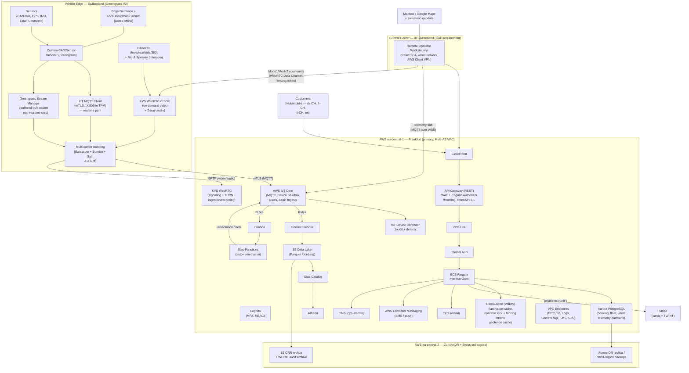
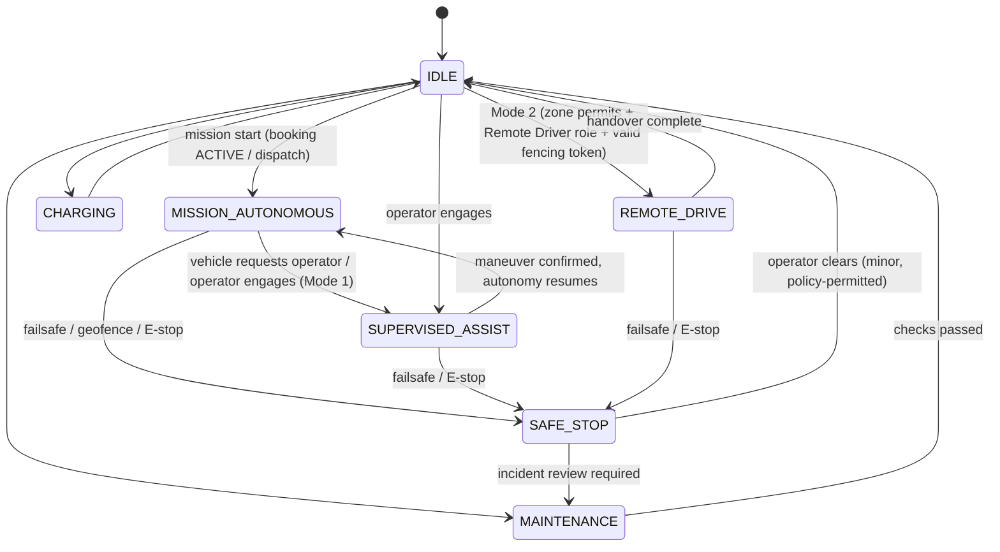
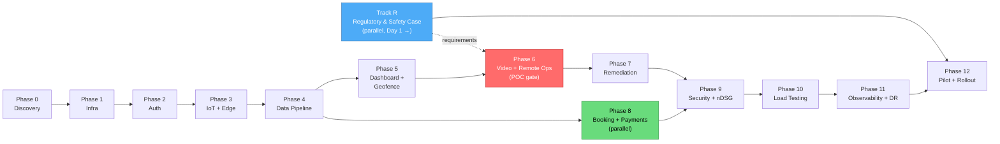

# JOPPILOT — Fleet Management & Remote Operation Platform
## Switzerland Edition — Plan v2.0 (June 2026)

> **Revision note.** This document reconstructs Plan v1 for a **Switzerland-only operation** and incorporates the June 2026 architecture review. Two classes of change drove the rewrite: (1) **AWS service-lifecycle facts** — Timestream for LiveAnalytics, Amazon Pinpoint, and AWS IoT FleetWise are all now closed to new customers, so v1's choices were partially unbuildable; (2) **Swiss law** — the Ordinance on Automated Driving (OAD/VAF, SR 741.26, in force 1 March 2025) defines *how* driverless vehicles may be operated and supervised, which reshapes the teleoperation module from "remote driving" into "remote supervision with maneuver confirmation" for public roads.

---

## Change Log: v1 → v2

| # | Area | v1 | v2 (this plan) | Driver |
|---|---|---|---|---|
| 1 | Hot telemetry store | Amazon Timestream (LiveAnalytics) | **Aurora PostgreSQL time-series partitions** + Valkey/Shadow last-value cache (alt.: Timestream for InfluxDB) | LiveAnalytics closed to new customers 20 Jun 2025; "TimescaleDB-on-RDS" fallback does not exist (extension not offered on RDS/Aurora) |
| 2 | Push / SMS | Amazon Pinpoint | **AWS End User Messaging** (SMS/push) + **SES** (email) + **SNS** (ops alarms) | Pinpoint closed to new customers 20 May 2025; end of support 30 Oct 2026 |
| 3 | CAN decoding | Custom decoder (FleetWise listed as risk) | Custom decoder (**unchanged — decision validated**) | FleetWise closed to new customers 30 Apr 2026 (maintenance mode) |
| 4 | Ingress path | CloudFront → ALB → API Gateway → ECS | **CloudFront → API Gateway (WAF + Cognito authorizer) → VPC Link → internal ALB → ECS** | Double front door removed; one throttling/auth surface |
| 5 | Realtime browser channel | API GW WebSocket (unused) + MQTT-over-WSS | MQTT-over-WSS retained; API GW WebSocket **dropped**; AppSync Events noted as fan-out alternative | Simplification |
| 6 | Region | Undecided (KVKK-driven) | **eu-central-1 (Frankfurt) primary; eu-central-2 (Zurich) for DR + Swiss-soil data copies** | IoT Core and KVS WebRTC are not available in Zurich; revFADP permits EU hosting (adequacy) |
| 7 | Teleoperation model | Direct remote driving everywhere | **Mode 1: Supervision & maneuver confirmation (public roads, OAD-compliant)**; **Mode 2: direct remote drive (private ground / special permits only)** | OAD/VAF: driverless vehicles on approved routes are *monitored* by a Switzerland-based operator who confirms/suggests maneuvers; continuous joystick driving is not the public-road model |
| 8 | Privacy regime | KVKK / GDPR | **revFADP (nDSG, in force 1 Sep 2023)** + FDPIC processes; GDPR only if EU data subjects are served | Swiss jurisdiction |
| 9 | Payments | Stripe *or* iyzico/PayTR (unresolved) | **Stripe (Swiss entity) — cards + TWINT**, CHF only, Swiss VAT 8.1%, QR-bill invoices | Stripe supports CH-domiciled accounts and TWINT; decision moved to Phase 0 ADR and resolved |
| 10 | i18n scope | Multi-market, multi-currency, multi-TZ | **de-CH, fr-CH, it-CH, en** · single currency (CHF) · single timezone (Europe/Zurich) | Switzerland-only, but inherently multilingual |
| 11 | Cache | ElastiCache Redis | **ElastiCache (Valkey engine)** | Lower cost; where AWS investment is going |
| 12 | Teleop safety | Heartbeat 3×100 ms hard trip | **Graded, speed-adaptive failsafe with hysteresis; dual-path E-STOP; fencing-token operator lock; mandatory session recording** | Architecture review: avoid false safe-stops, split-brain, and liability gaps |
| 13 | Edge security | Software keystore | **TPM/secure element (PKCS#11) for X.509 keys, secure boot, tamper alerts; IoT Device Defender added** | Rental vehicles = hostile physical access |
| 14 | Telemetry cost | All data via MQTT | **MQTT Basic Ingest + message batching for state/alerts; Greengrass Stream Manager → S3 for bulk/high-rate data** | Per-message MQTT pricing at 200 vehicles |
| 15 | Networking cost | NAT for all egress | **VPC endpoints** (ECR, S3, Logs, Secrets Manager, KMS, STS) | NAT data processing is a silent leak |
| 16 | DDoS | WAF + Shield (Advanced implied) | WAF + **Shield Standard** (Advanced deferred) | USD 3k/mo + 1-yr commit not justified at this scale |
| 17 | New | — | **Regulatory Track R**: cantonal route authorization, safety case, operator qualification, FEDRO/ASTRA liaison — runs in parallel from day 1 | OAD authorization is the schedule's long pole |
| 18 | New | — | **Two-way audio (passenger intercom)** and **digital pre-departure check workflow** | Explicit operator/owner duties under OAD |
| 19 | Process | — | Every ADR gains a **"service longevity / lifecycle status" check**; thin abstraction layers over TSDB and video signaling | Three v1 services hit maintenance mode within a year |

---

## Section A: System Summary

The platform consists of **three capability blocks**, now framed against Swiss law:

1. **Fleet Management & Diagnostics.** Remote monitoring, sensor/telemetry collection, durable logging, automatic remediation of resolvable faults. In Switzerland this block also *operationalizes legal owner duties* under the OAD: keeping the automation system updated and maintained per manufacturer guidance, and ensuring **daily pre-departure checks** are completed and recorded.
2. **Remote Operation (redefined).**
    - **Mode 1 — Supervision & Assistance (public roads).** The OAD permits driverless (SAE L4) vehicles on **cantonally approved routes** under real-time monitoring by a **remote operator located in Switzerland**. The operator activates/deactivates the automation system, confirms pre-departure checks, **reviews and confirms maneuvers proposed by the vehicle** when it cannot resolve a situation alone, intervenes to reduce risk (safe-stop / E-stop), and handles **passenger communication**. The platform's video, audio, telemetry, and command infrastructure serves this supervision model.
    - **Mode 2 — Direct Remote Driving.** Gamepad/joystick teleoperation (the v1 model) is **restricted to non-public ground** (depots, private sites, test areas) or operations under special permits. Zone type is enforced *at the vehicle*: public-route geofence zones reject continuous drive commands regardless of what the cloud sends.
3. **Booking (Rental) System.** Swiss-market customer rentals: CHF pricing, **TWINT + card** payments via Stripe, Swiss VAT (8.1%), **QR-bill** invoices, customer portal in **German, French, Italian, and English**.

## Section B: Scope

- Fleet monitoring, diagnostics, logging, auto-remediation; digital pre-departure check workflow.
- Remote-operation **infrastructure**: on-demand video transport, two-way audio (passenger intercom), command channel (Mode 1 + Mode 2 command sets), session management with fencing-token locking, mandatory session recording, failsafe.
- Booking system + Stripe payment integration (cards + TWINT, CHF).
- Cloud infrastructure (Frankfurt primary, Zurich DR), security, observability, scale to 200 vehicles.
- Localization for Switzerland: de-CH / fr-CH / it-CH / en; CHF; Europe/Zurich; Swiss formats (1'234.56, dd.mm.yyyy).
- API documentation (OpenAPI 3.1) and versioning.
- Geofencing with edge-side enforcement; zone types gate command classes (Mode 1 vs Mode 2).
- **Regulatory Track R** (parallel): OAD gap analysis, cantonal route authorization dossier, safety case (ISO 26262 / ISO 21448 / ISO/SAE 21434, UNECE R155/R156), operator qualification & training program, event-data-recording specification, insurance arrangement, FEDRO (ASTRA) liaison.
- Out of scope (unchanged): the autonomy stack itself (Kapsam B2) — the platform supervises and integrates with it.

## Section C: Architecture Overview

### C.1 Region strategy (decided)

| Plane | Region | Rationale |
|---|---|---|
| IoT connectivity (IoT Core, Greengrass cloud side, Device Defender) | **eu-central-1 Frankfurt** | IoT Core is **not available** in eu-central-2 (Zurich) |
| Video/audio (KVS WebRTC signaling + TURN + recording) | **eu-central-1 Frankfurt** | KVS WebRTC region list does not include Zurich; Frankfurt is the nearest supported region (~6–10 ms RTT from CH — measured in the Phase 6 POC) |
| Application & data (API GW, ECS, Aurora, Valkey, S3, Cognito) | **eu-central-1 Frankfurt** | Single-region simplicity; co-location with the IoT/video planes |
| DR + Swiss-soil copies | **eu-central-2 Zurich** | S3 cross-region replication and Aurora cross-region replica/backups give a data copy on Swiss territory and a DR target |
| Control center (human operators) | **Switzerland (physical)** | OAD requires the supervising operator to be based in Switzerland; workstations on wired links + AWS Client VPN |

Legal basis: the revFADP does **not** mandate in-country storage for this data; cross-border disclosure to EU/EEA states is permitted (adequacy). If a future contract demands Swiss-resident primary data, Option B (documented in ADR-Region): move Aurora/S3 primaries to Zurich and keep only the IoT/video planes in Frankfurt — accepted as added complexity, not the default.

### C.2 Architecture diagram

### C.3 Key flow changes vs. v1

- **Ingress:** one front door. CloudFront serves the SPA and proxies `/api/*` to a regional API Gateway carrying WAF, the Cognito authorizer, per-key throttling, and the OpenAPI contract; API Gateway reaches ECS through a VPC Link to an **internal** ALB. The public ALB is removed.
- **Telemetry hot path:** IoT Rules write low-frequency state/alerts to **Aurora telemetry partitions** (via Lambda batch writer) and everything to Firehose → S3. Last-known vehicle state lives in **Device Shadow + Valkey**; dashboards read live values from there and history from Aurora (0–90 days) or Athena (older).
- **Bulk path:** high-rate raw data (100 Hz IMU, CAN dumps, lidar metadata) bypasses MQTT entirely via **Greengrass Stream Manager → S3** (bandwidth-aware, disk-buffered, prioritized). Custom SQLite store-and-forward is built **only if** Stream Manager evaluation fails.
- **Recording:** every Mode 1/Mode 2 session is recorded — media via KVS WebRTC ingestion-and-storage, commands/telemetry as time-synced structured logs — and archived to S3 with Object Lock (WORM), replicated to Zurich.

## Section D: Technology Choices and Rationale (revised)

| Need | Chosen service | Status / Rationale |
|---|---|---|
| **Identity & auth** | **Amazon Cognito** | Unchanged. Invite-only (self-signup off), MFA (TOTP) mandatory for Admin/Operator, JWT-based RBAC. |
| **Vehicle connectivity backbone** | **AWS IoT Core + Greengrass V2** | Both actively supported (Greengrass **V1** EOS Oct 2026 — irrelevant, we use V2). X.509 mTLS, Device Shadow, Rules Engine, **Basic Ingest** for cost. |
| **Fleet security monitoring** | **IoT Device Defender** *(new)* | Audit (cert hygiene, policy drift) + Detect (anomalous MQTT behavior). Was missing in v1. |
| **CAN/sensor decoding** | **Custom Greengrass component** | FleetWise is closed to new customers (Apr 2026) — v1's hedge is now mandatory. DBC-driven decoder, versioned via Greengrass deployments. |
| **Edge buffering (non-realtime)** | **Greengrass Stream Manager** (evaluate first) | Built-in prioritized, bandwidth-aware, disk-buffered export to S3/Kinesis. Custom SQLite buffer only as fallback. Realtime/teleop data is **never** buffered (failsafe instead). |
| **Connectivity resilience** | **Multi-carrier bonded cellular** — Swisscom + Sunrise + Salt | Phase 0 buy-vs-build ADR; default **buy** (COTS bonded router, Peplink SpeedFusion class). WebRTC ICE fails over but does not aggregate — bonding needs the tunnel layer. |
| **OTA / fleet software** | **Greengrass Deployments + IoT Jobs** | Canary (1–2 vehicles) → verify → fleet; automatic rollback; version inventory. Maps to the OAD owner duty of keeping the system updated; UNECE R156 (SUMS) alignment. |
| **Telemetry time-series** | **Aurora PostgreSQL partitions** (pg_partman, BRIN indexes) | Timestream LiveAnalytics closed to new customers (Jun 2025); TimescaleDB not offered on RDS/Aurora. Aurora keeps one ops surface and runs in Zurich too if Option B is ever invoked. **Alternative:** Timestream for InfluxDB (Frankfurt; instance-based pricing) — behind a thin DAO so the choice is swappable. |
| **Last-value / realtime cache** | **ElastiCache (Valkey)** | Sub-ms reads; operator lock **with fencing tokens**; geofence polygon cache. Valkey engine for cost and longevity. |
| **Raw data / lake** | **S3 + Glue + Athena**; Firehose delivery | Parquet, date/vehicle partitioned. Optional modernization: Firehose → **Apache Iceberg / S3 Tables** for compaction & schema evolution. |
| **Relational data** | **Aurora PostgreSQL (Multi-AZ)** | Booking state machine; **double-booking prevention via `EXCLUDE USING gist` + btree_gist on tstzrange** (kept — correct mechanism); read replicas; cross-region replica to Zurich. |
| **Low-latency video/audio** | **KVS WebRTC** *(POC gate retained)* | Frankfurt region (not in Zurich). Sub-second SRTP; **on-demand sessions only**; **two-way audio** added for the OAD passenger-communication duty; ingestion-and-storage for session recording. **Plan B documented:** self-hosted coturn (Frankfurt AZ-pinned) or LiveKit/mediasoup SFU on EC2. |
| **Command channel** | **WebRTC Data Channel** (primary) + **IoT Core MQTT QoS1** (backup) | Every command carries session id + **fencing token**; E-STOP is transmitted on **both paths simultaneously**, deduplicated by command id at the vehicle. |
| **Backend services** | **ECS Fargate** | Unchanged. Microservices; autoscaling. |
| **API layer** | **API Gateway (REST) + VPC Link → internal ALB** | Single front door (fixes v1's ALB→APIGW chain). Cognito authorizer, usage plans, throttling. Live telemetry stays on MQTT-over-WSS; **AppSync Events** noted as a simpler dashboard fan-out alternative if per-browser IoT policies become painful. |
| **Auto-remediation** | **IoT Rules → Lambda → Step Functions** | Unchanged; escalation to operator aligns with OAD operator duties. |
| **Frontend** | **React/Next.js SPA + CloudFront** | i18n: de-CH, fr-CH, it-CH, en (next-intl/react-i18next, ICU formats); WCAG 2.1 AA; E-STOP accessibility. |
| **Payments** | **Stripe (Swiss entity)** — cards + **TWINT** | Stripe supports CH-domiciled accounts; TWINT presents in CHF, **max CHF 5,000/transaction, single-use (no recurring)** → deposits and recurring charges ride on cards. Stripe Radar for fraud. VAT 8.1% (standard) / 2.6% (reduced); **Swiss QR-bill** on invoices. Local PSP fallback (Payrexx/Wallee/Datatrans) documented in the ADR if PostFinance Pay coverage is later required. |
| **Notifications** | **SES + AWS End User Messaging + SNS** | Pinpoint removed (closed to new customers; EOS 30 Oct 2026). SES = email; EUM = SMS/push (CH alphanumeric sender IDs); SNS = internal/ops alarm fan-out. |
| **Maps & geofencing** | **Mapbox GL JS / Google Maps** + **swisstopo (geo.admin.ch) geodata** | swisstopo gives authoritative free Swiss base data for route/zone definition; app handles LV95 ↔ WGS84 where needed. Geofence enforcement remains **edge-side**. |
| **IaC** | **Terraform** (or CDK) | Two regions (eu-central-1, eu-central-2) bootstrapped from day 1; S3 backend + DynamoDB lock. |
| **Security stack** | WAF, **Shield Standard**, GuardDuty, Security Hub, Inspector, Macie, KMS, Secrets Manager, CloudTrail, **Device Defender** | Shield Advanced deferred (cost). CloudTrail + S3 Object Lock (WORM) unchanged. |
| **Network access control** | **AWS Client VPN** + IP-based SGs | Operator access only from the Swiss control center network/VPN. |
| **API docs** | **OpenAPI 3.1 + Swagger UI/Redoc** | Unchanged; versioned `/api/v1/`. |

## Section E: User Roles (RBAC)

| Role | Permissions | Swiss-specific notes |
|---|---|---|
| **Super Admin** | Full authority: users/vehicles/roles, configuration, emergency control, operator-lock takeover (increments fencing token). | — |
| **Fleet Manager** | Monitoring, fault reports, maintenance planning, pre-departure check oversight. | Carries the practical execution of OAD *owner duties* (updates, maintenance, daily checks). |
| **Remote Operator** *(renamed from Teleoperator)* | Live monitoring, Mode 1 supervision (maneuver confirm/reject, ADS activate/deactivate, safe-stop, E-stop, passenger comms, pre-departure confirmation), diagnostics intervention. Only assigned vehicles. | Must be **based in Switzerland**; qualification & training records kept per OAD; operator-to-vehicle supervision ratio is a configuration item bound to the authorization conditions. |
| **Remote Driver** *(new, subset of operators)* | Mode 2 direct remote driving — enabled **only** in zones whose type permits it (depots, private ground, permitted test areas). | Separate permission so public-road supervision rights never imply joystick rights. |
| **Booking Agent** | Rental request management, customer management, pricing. | Works in customer's language (de/fr/it/en). |
| **Customer** | Own bookings, invoices (QR-bill), history. | Portal in 4 languages. |
| **Viewer / Auditor** | Read-only (audit/compliance, incident review incl. session recordings per policy). | — |

## Section F: Vehicle State Model (v2 — redesigned)

v1's flat state diagram (flagged "to be worked on") had ERROR reachable only from teleop and no recovery path. v2 models **three orthogonal dimensions**; the UI renders their combination.

**1. Connectivity:** `OFFLINE → DEGRADED → ONLINE` (driven by bonded-link health; DEGRADED = at least one carrier down or KPIs below threshold).

**2. Health:** `OK → DEGRADED → ERROR`, plus latched flag `SAFE_STOPPED`. ERROR is reachable from **any** state. Recovery: `ERROR → MAINTENANCE (mode) → IDLE` after diagnostics clear; auto-remediation may resolve `DEGRADED/ERROR` without mode change.

**3. Operational mode:**

**Invariants (enforced at the edge, mirrored in cloud):**
- `REMOTE_DRIVE` requires: zone type ∈ {depot, private, permitted-test} **and** health ∈ {OK, DEGRADED} **and** a currently valid fencing token. Public-route zones reject continuous drive commands at the vehicle, regardless of cloud state.
- `SAFE_STOPPED` latches until explicitly cleared; every entry creates an incident record + preserves the session recording.
- Booking `ACTIVE` ⇔ vehicle reservable/mission-bound; transitions are synchronized through `fleet-service`, never written directly by the booking service.
- All mode transitions and operator handovers are appended to the WORM audit log with actor, fencing token, and correlation id.

## Section G: Phase-by-Phase Project Plan

> Engineering Phases 0–12 are joined by **Track R (Regulatory)** which starts on day 1 and runs in parallel to the end of the pilot. Track R is the schedule's most likely long pole: cantonal route authorization timelines are outside the team's control.

### TRACK R: Regulatory, Authorization & Safety Case (parallel, Day 1 → Pilot)

- **R.1 OAD/VAF gap analysis:** map every ordinance duty (operator, owner, vehicle, data) to a platform feature or operating procedure; identify what is product vs. process.
- **R.2 Route & canton strategy:** select pilot route(s); early engagement with the cantonal authority and FEDRO (ASTRA), which issues assessment instructions and runs an accompanying group; leverage the Swiss AV ecosystem (e.g., SAAM) and published minimum requirements work for remote-operation systems.
- **R.3 Safety case:** ISO 26262 + ISO 21448 (SOTIF) argumentation for the supervision system boundary; **ISO/SAE 21434** cybersecurity engineering + UNECE **R155 (CSMS)** and **R156 (SUMS)** process evidence (OTA pipeline is the SUMS artifact).
- **R.4 Operator program:** qualification profile, training curriculum, certification records, shift/attention management, operator-to-vehicle ratio justification — all referenced by the authorization dossier.
- **R.5 Event data recording specification:** what is recorded (video, audio, commands, telemetry, ADS decisions), time sync, retention, access control — agreed with counsel/insurer/authority before Phase 6 freezes the design.
- **R.6 Insurance:** Swiss compulsory motor liability (holder liability is unchanged by the OAD — owner remains strictly liable); negotiate terms that recognize the recording/failsafe stack.
- **R.7 Data protection:** revFADP DPIA for video/location/passenger data; processing register (ROPA); privacy notices in de/fr/it; camera anonymization policy for bystanders (faces/plates).

**Exit criterion:** authorization granted for the pilot route; operator program accepted; safety case reviewed.

### PHASE 0: Discovery, Architecture & Preparation — 2–3 weeks

- **0.1 Requirements analysis** — use cases, roles, sensor types, volumes (unchanged).
- **0.2 Vehicle data definitions** — unchanged list (GPS, speed, battery V/A/°C/SOC, motor, DTC, IMU, lidar metadata, cameras, ultrasonic, compute health, network) **+ pre-departure check item schema + ADS maneuver-proposal schema** (the Mode 1 contract with the autonomy stack).
- **0.3 Command catalog (revised):**
    - *Mode 1 (public roads):* ConfirmManeuver / RejectManeuver / SelectAlternative, StartMission / PauseMission / AbortMission, ActivateADS / DeactivateADS, SafeStop, **E-STOP (dual-path)**, ResumeAutonomy, OpenIntercom / Door & passenger-safety actions, ConfirmPreDepartureCheck.
    - *Mode 2 (restricted zones):* Drive (steer/throttle/brake), creep-speed maneuvers, Turn.
    - *Diagnostics:* Restart Service / Computer / Sensor, Update Config.
    - Every command: command id, session id, **fencing token**, timestamp; idempotent handling at the edge.
- **0.4 ADRs** — each ADR now includes a **service lifecycle check** (is the service GA, in maintenance, or sunset? what is the exit path?). Pre-resolved ADRs: region (C.1), time-series store (D), payments (Stripe + TWINT), bonding **buy-vs-build** (default: buy COTS), video on-demand (**default: on-demand**, unchanged).
- **0.5 AWS account structure** — AWS Organizations multi-account (dev/staging/prod + security/log archive), unchanged.
- **0.6 Region** — **decided**: eu-central-1 primary, eu-central-2 DR (Section C.1). Verify per-service availability in both regions as a checklist item (replaces v1's 0.11).
- **0.7 Cost model** — unchanged logic; key lever remains video-on-demand (egress scales with ~5–15 concurrent sessions, not fleet size). Add: MQTT message budget with Basic Ingest + batching assumptions; TURN relay minutes; billing alarms from day 1.
- **0.8 Video flow model** — on-demand confirmed (also a privacy-by-design argument under revFADP: no continuous street video without need).
- **0.9 Connectivity architecture** — multi-carrier bonding across **Swisscom/Sunrise/Salt**; buy-vs-build ADR; **per-route coverage survey** (tunnels, alpine valleys) feeds Track R route selection.
- **0.10 Regulation & functional safety** — handled by Track R; Phase 0 contributes the platform-side inputs.
- **0.11 i18n strategy** — fixed: de-CH, fr-CH, it-CH, en; CHF; Europe/Zurich; ICU message formats; translation workflow (keys → professional translation in Phase 12).
- **0.12 Accessibility** — WCAG 2.1 AA target retained; E-STOP accessibility emphasized.

**Outputs:** SRS, architecture diagram, ADRs (with lifecycle checks), cost model, Track R kickoff dossier, i18n strategy.

### PHASE 1: Infrastructure Foundation (IaC + CI/CD + Network) — 2–3 weeks (W4–6)

- **1.1 IaC:** Terraform, S3 backend + DynamoDB lock; **two regions** bootstrapped.
- **1.2 VPC (Frankfurt):** Multi-AZ; public subnets only for NAT + (if needed) bastion; **API Gateway is regional-managed, not subnet-resident** — compute and data stay private. **VPC endpoints** for ECR, S3, CloudWatch Logs, Secrets Manager, KMS, STS (NAT cost control). Zurich: minimal footprint (replica subnets).
- **1.3 IAM:** least privilege, root locked, SCPs, Secrets Manager + rotation (unchanged).
- **1.4 KMS:** key per data category (unchanged), keys in both regions for replicated data.
- **1.5 CI/CD:** lint → unit test → SAST → container scan (Trivy/ECR) → build → ECR → ECS deploy; dev/staging/prod (unchanged).
- **1.6 Observability seed:** CloudTrail (Object Lock), CloudWatch Logs + KMS, billing alarms (unchanged).

**Done when:** hello-world service auto-deploys; infra reproducible from code in both regions.

### PHASE 2: Authentication & Authorization — 1–1.5 weeks (W7)

Unchanged from v1 (Cognito invite-only via SES, 12+ char passwords, TOTP MFA mandatory for Admin/Operator/Remote Driver, rate limiting + lockout, Cognito groups → JWT claims → API GW authorizer + middleware, 15-min access / 7-day refresh tokens, 30-min idle timeout, immutable audit to S3 Object Lock). Privacy notices and consent texts prepared in de/fr/it/en (Track R.7 input).

### PHASE 3: Vehicle Connectivity Backbone (IoT Core + Greengrass Edge) — 2–3 weeks (W8–10)

- **3.1 Topic hierarchy:** as v1 (`fleet/{vehicleId}/telemetry|diagnostics|status|commands|commands/response|alerts|geofence`) **+ `fleet/{vehicleId}/maneuvers` (proposals/decisions) + `fleet/{vehicleId}/checks` (pre-departure)**. Telemetry publishes use **Basic Ingest** (`$aws/rules/...`) where only Rules consume them; samples batched per message (≤128 KB).
- **3.2 Provisioning:** X.509 + mTLS, Fleet Provisioning Template, revocation = immediate disconnect (unchanged) — **private keys generated and held in TPM/secure element (PKCS#11)**; secure boot; disk encryption; tamper alert topic.
- **3.3 Device Shadow:** v1 fields + `operationalMode`, `fencingToken`, `zoneType`, `preDepartureStatus`, `safeStopLatched`.
- **3.4 Greengrass V2 edge:** custom CAN decoder; **Stream Manager** for buffered bulk export (custom SQLite buffer only if evaluation fails); edge geofence + **local deadman** (operates with zero connectivity); bonded-link health agent; local filtering. Realtime/teleop data is never buffered.
- **3.5 Vehicle simulator:** parametric Python (vehicle count, rates, fault injection) **+ maneuver-proposal simulation** for Mode 1 testing.
- **3.6 OTA:** Greengrass Deployments + IoT Jobs; canary 1–2 vehicles → verify → fleet; auto-rollback; version inventory. Explicitly documented as the **UNECE R156 / OAD owner-duty** mechanism.
- **3.7 Device Defender:** audit checks + detect profiles (message rate, auth failures, connection anomalies) with SNS alarms.

**Done when:** mTLS works; revocation cuts the link; offline buffering is lossless for non-realtime data; keys never leave the secure element.

### PHASE 4: Data Pipeline — 1.5–2 weeks (W10–12)

- **4.1 IoT Rules:** `telemetry` → Lambda batch-writer → **Aurora telemetry partitions** + Firehose; `diagnostics` → Lambda + Firehose; `alerts` → SNS + Lambda; `geofence` → Lambda + SNS; `maneuvers`/`checks` → Lambda → Aurora (+ audit).
- **4.2 Hot storage:** Aurora partitioned tables (daily/weekly partitions via pg_partman; BRIN on time; per-vehicle subpartition if needed). Retention: 90 days hot, then drop partitions (data persists in S3).
- **4.3 Cold storage:** Firehose → S3 Parquet (date/vehicle partitioning), Glue, Athena (unchanged); optional Iceberg/S3 Tables upgrade.
- **4.4 Lifecycle:** Hot (0–90 d Aurora) → S3 Standard (0–90 d) → S3 IA (90 d–1 y) → Glacier (1 y+) → deletion per **revFADP retention schedule** (defined with counsel in Track R.7). IaC-managed.
- **4.5 Predictive-maintenance data model:** unchanged (battery degradation, sensor drift, vibration trends) — stored in the same partitioned tables; ML deferred.
- **4.6 Audit/security log:** CloudTrail + S3 Object Lock, replicated to Zurich (unchanged + replication).
- **4.7 Schema versioning:** telemetry JSON schema versioned, backward compatible (unchanged).

**Done when:** 24 h of data queryable both live (Aurora/Valkey) and historically (Athena); zero loss; partitions rotate automatically.

### PHASE 5: Fleet Monitoring, Diagnostics, Geofencing & Dashboard — 2–3 weeks (W12–14)

- **5.1 Services:** `fleet-service`, `telemetry-service`, `diagnostics-service`, `geofence-service`, **`check-service`** (pre-departure workflow) on ECS Fargate.
- **5.2 API layer:** REST behind API GW (Cognito authorizer, throttling, `/api/v1/`, OpenAPI 3.1 + Swagger/Redoc); live telemetry via MQTT-over-WSS (Cognito identity + per-identity IoT policy); AppSync Events kept as a documented fan-out alternative.
- **5.3 Diagnostics metrics:** unchanged (compute, battery, network, sensors, autonomy/route deviation) + bonded-link per-carrier KPIs.
- **5.4 Geofencing:** polygon authoring on map (swisstopo base data; LV95↔WGS84 conversion), **zone types** (public-route / depot / private / test) gate command classes; zone→vehicle assignment; violation → alarm + optional stop; polygons pushed to edge (works offline).
- **5.5 Dashboard:** vehicle list + 3-dimension state (Section F), map + zones, vehicle detail (live telemetry/diagnostics), pre-departure check queue, filtering/search/reports (CSV/PDF). **i18n (4 locales), WCAG 2.1 AA**, E-STOP accessibility.
- **5.6 Alarms:** thresholds as v1 (`battery < 15%`, `camera offline`, `lidar error`, `latency > 500 ms`, `geofence violation`) **+ `pre-departure incomplete`, `Device Defender anomaly`, `carrier down`** → SNS (ops) + **End User Messaging** (push/SMS) + dashboard.

**Done when:** live monitoring works; alarms fire; geofence violations alert; API docs reachable; checks workflow demonstrated.

### PHASE 6: Low-Latency Video/Audio & Remote Operation — 3–4 weeks (W14–18)

> **POC gate (go/no-go) retained and extended.** Glass-to-glass latency measured on **real Swiss cellular** (Swisscom/Sunrise/Salt, bonded), including the **CH ↔ Frankfurt TURN** leg, before the phase proceeds. If targets are missed: plan B (coturn pinned in Frankfurt, or LiveKit/mediasoup SFU on EC2) — decision pre-documented.

- **6.1 KVS WebRTC:** dynamic signaling channels, STUN/TURN, strict **on-demand** session lifecycle (unchanged) + **ingestion-and-storage enabled for session recording** → lifecycle to S3 (Object Lock) → CRR to Zurich.
- **6.2 Vehicle media:** KVS WebRTC C SDK, GStreamer H.264 → SRTP, adaptive bitrate (720p ↔ 480p ↔ 360p), multi-camera, **+ two-way audio (passenger intercom — OAD operator duty)**.
- **6.3 Operator player:** React + KVS WebRTC JS SDK, STS credentials, TURN relay, **latency overlay (ms)** + per-carrier link quality (RTT, loss, bandwidth).
- **6.4 Command channel:** WebRTC Data Channel primary, MQTT QoS1 backup, ACKs; **fencing token in every command**; **E-STOP sent on both channels simultaneously**, deduplicated by command id.
- **6.5 Operator console:** *Mode 1* — maneuver proposal cards (confirm/reject/select alternative), mission controls, ADS activate/deactivate, safe-stop, **E-STOP (large, red, keyboard-reachable, WCAG-compliant)**, intercom, pre-departure confirmation. *Mode 2* — gamepad (Gamepad API), virtual joystick, keyboard; UI exposes Mode 2 only when zone + role + token allow.
- **6.6 Single-operator lock:** Valkey lease + **monotonic fencing token validated at the vehicle**; authoritative session row in Aurora; takeover (Admin) increments the token; all handovers logged (WORM). 1:N supervision layout (multi-vehicle wall) with alarm-driven attention management; takeover is always 1:1.
- **6.7 Connection resilience:** bonded multi-WAN validation; graceful degradation order unchanged (bitrate ↓ → video minimize → keep control → safe-stop).
- **6.8 Failsafe v2 (non-negotiable, parameters tuned in POC/pilot):** heartbeat at 100 ms retained, but the trip logic is **graded and speed-adaptive with hysteresis** — sustained-loss windows scale with speed (slower vehicle → longer grace), N-of-M miss detection replaces "3 consecutive", staged response (speed cap → controlled slowdown → safe-stop). Hard triggers unchanged in kind: video staleness beyond threshold, sustained heartbeat loss, link loss, geofence breach. The vehicle's **local deadman** enforces all of this with zero connectivity.

**Done when:** sub-second video + audio; Mode 1 round-trip (proposal → confirm → execution) works; Mode 2 works in a depot zone and is rejected in a public-route zone; link cut ⇒ controlled safe-stop without false-positive storms; every session leaves a complete recording.

### PHASE 7: Auto-Remediation — 1.5–2 weeks (W18–20)

Unchanged in mechanics (fault catalog: resolvable vs. non-resolvable; IoT Rules + Lambda detection; Step Functions ladder: command → 5 s → shadow check → compute restart → 30 s → escalate via SNS + dashboard; full audit trail). v2 additions: escalation lands in the **Remote Operator queue** consistent with OAD operator duties; remediation never overrides a latched `SAFE_STOPPED`; every automated action is recorded with correlation id.

### PHASE 8: Booking System & Payments (parallel from Phase 5) — 3–4 weeks (W18–22)

- **8.1 Schema:** `vehicles`, `customers` (+ risk score), `bookings`, `booking_audit_logs`, `pricing_rules`, `payments`, `invoices` — **CHF only** (money columns keep ISO currency code for future-proofing, validated to CHF).
- **8.2 State machine:** `DRAFT → PENDING → APPROVED → PAYMENT_PENDING → ACTIVE → COMPLETED` (+ `REJECTED`, `CANCELLED`); every transition logged (unchanged).
- **8.3 Booking service:** CRUD + **double-booking protection via PostgreSQL `EXCLUDE USING gist` on (vehicle_id, tstzrange)** + transactional locking; calendar API; dynamic pricing (unchanged, single currency).
- **8.4 Payments (Stripe, Swiss entity):** Payment Intents; **cards + TWINT** (TWINT: CHF presentment, ≤ CHF 5,000/transaction, single-use → **deposits, holds and any recurring charges use cards**); PCI DSS via Stripe (no card data on our servers); refunds incl. partial; **Swiss VAT 8.1% standard / 2.6% reduced** on pricing and invoices; **QR-bill** payment part on every invoice (e.g., swissqrbill library); PSD2 does not apply in CH but 3-D Secure is enabled for card risk.
- **8.5 Fraud:** **Stripe Radar** + custom rules (IP/card/behavior risk scoring; high risk → manual approval; fraud logs) — unchanged, now actually available since the PSP is Stripe.
- **8.6 Notifications:** SES (email) + **AWS End User Messaging** (push/SMS) — Pinpoint removed.
- **8.7 Customer portal:** request, pay (Stripe Elements/Checkout — TWINT supported), status tracking, **QR-bill invoice download**; **de-CH / fr-CH / it-CH / en**; Swiss formats (1'234.56 CHF, dd.mm.yyyy).
- **8.8 Agent panel:** request management, vehicle calendar, fraud alerts (unchanged).
- **8.9 Fleet integration:** booking ⇄ vehicle availability synchronized exclusively through `fleet-service` (Section F invariant).

**Done when:** request → payment (TWINT and card) → approval → "occupied" → log → conflict rejection → fraud flag; invoice carries correct VAT and a scannable QR-bill.

### PHASE 9: Security & Privacy Hardening — 1.5–2 weeks (W22–24)

- **9.1–9.6** Network tightening, WAF rules, encryption (KMS at rest; TLS 1.3 + SRTP + mTLS in transit), GuardDuty/Security Hub/Inspector/Macie, Secrets Manager (zero hard-coded secrets), CloudTrail full + immutable — all unchanged.
- **9.7 Privacy (revFADP / nDSG)** *(replaces KVKK/GDPR section)*:
    - Processing register (ROPA); privacy-by-design/default evidence (on-demand video is itself a measure).
    - Privacy notices in **de/fr/it** (+ en) for customers, passengers, and staff; camera signage policy for vehicles.
    - **Camera anonymization** for bystanders (face/plate blurring) on any footage used outside incident/legal purposes.
    - Cross-border map: primary processing in **EU (Frankfurt) — adequate**; US sub-processors (e.g., Stripe) via **Swiss–US Data Privacy Framework** or recognized contractual safeguards; documented in the ROPA.
    - **Breach process:** notify the **FDPIC "as soon as possible"** for high-risk breaches (no fixed 72 h rule as in GDPR); affected-person notification criteria defined; runbook in Phase 11 references it.
    - Data subject rights: access/export/deletion ("right to be forgotten") workflows — deletion respects legal retention holds (incidents, accounting).
    - Note: revFADP imposes **personal criminal fines (up to CHF 250,000) on responsible individuals** — named accountability for privacy decisions is part of the operating model. A DPO is not mandatory but a privacy owner is appointed.
    - GDPR applies **only if** EU-resident data subjects are served; current scope (CH-only) keeps nDSG primary.
- **9.8 Penetration test** — unchanged (internal/external, fix, retest), now explicitly covering the command channel, fencing-token logic, and recording store.
- **9.9 Incident response** — unchanged + FDPIC notification path replaces the GDPR 72 h reference.

**Done when:** no critical pen-test findings; all data encrypted; nDSG artifacts (ROPA, notices, DPIA, deletion workflow) complete.

### PHASE 10: Scalability & Load Testing — 2 weeks (W24–26)

- **10.1 Autoscaling:** ECS, Aurora (read replicas + Serverless v2 where it fits), Valkey, Kinesis shards (unchanged).
- **10.2 Telemetry load:** 10 → 50 → 100 → 200 simulated vehicles (~2,000 msg/s with batching); measure IoT Core throughput, **Aurora write path + partition maintenance**, Firehose, Lambda concurrency, connection pools.
- **10.3 Video load:** 5 → 10 → 20 concurrent WebRTC sessions; latency/bandwidth; KVS + **TURN quota** verification in eu-central-1.
- **10.4 Booking load:** Locust/k6, 500+ concurrent; Stripe rate limits.
- **10.5 Bottleneck remediation:** unchanged.
- **10.6 Cost optimization:** 200-vehicle projection; verify Basic Ingest/batching savings, Stream Manager S3 path vs MQTT, VPC-endpoint NAT savings; right-sizing; Savings Plans.

**Done when:** 200 vehicles within latency/loss targets; autoscaling proven; cost projection signed off.

### PHASE 11: Observability & Operational Readiness — 1.5 weeks (W26–27)

- **11.1** CloudWatch dashboards/alarms (p50/p95/p99 latencies, error rates, IoT messages, WebRTC sessions, payment success) — unchanged.
- **11.2** X-Ray / OpenTelemetry tracing — unchanged.
- **11.3** Structured JSON logs + correlation ids (commands ↔ recordings ↔ incidents) — unchanged, correlation extended to session recordings.
- **11.4** Runbooks & incident response (P1–P4, on-call) — + FDPIC breach runbook, + OAD incident workflow (safe-stop latched → operator → fleet manager → authority/insurer notification as applicable).
- **11.5 DR:** Aurora PITR + cross-region replica to **eu-central-2**; S3 CRR to Zurich; documented **RTO/RPO per plane** — app/data plane fails over to Zurich; **IoT and video planes are pinned to Frankfurt** (re-provisioning runbook, honest RTO; no fictional multi-region MQTT failover). DR drill executed.
- **11.6 SLA:** uptime 99.9%, video latency, API response targets — unchanged.
- **11.7 Documentation:** operator manual (Mode 1 procedures, OAD duties), fleet-manager guide (checks, maintenance, OTA), booking-agent guide, customer help — **operator docs in DE (+FR as needed), customer docs in de/fr/it/en**; API reference + changelog.

**Done when:** simulated failure detected and handled via runbook in minutes; Frankfurt→Zurich data DR demonstrated.

### PHASE 12: Pilot, Localization Completion & Staged Rollout — 6–8 weeks (W27–35)

- **12.1 Pilot (1–2 vehicles) on the authorized route** (Track R exit): end-to-end booking → payment → live monitoring → Mode 1 supervision (incl. real maneuver confirmations) → fault → remediation → geofence. Mode 2 validated in the depot. Measured: glass-to-glass latency, command latency, packet loss, FPS, failsafe behavior (incl. false-positive rate of the graded failsafe), AWS cost, UX, payment success. 3–4 weeks.
- **12.2 Feedback & fixes** + WCAG audit (axe/Lighthouse) — unchanged.
- **12.3 Localization completion:** professional de-CH/fr-CH/it-CH translation; CHF/TWINT/card payment-path verification; format checks; legal texts per language.
- **12.4 Compliance package:** revFADP audit artifacts; WCAG 2.1 AA report; ISO/SAE 21434 + UNECE R155/R156 evidence; **OAD authorization conditions verified in product** (operator-in-CH access control, recording, check workflow, maneuver-confirmation logs).
- **12.5 Staged scale:** 5 → 10 → 50 → 100 → 200 vehicles; metric gates each step; new routes repeat Track R.2 per canton.
- **12.6 Go-live:** full operation; multilingual support desk (ticketing, knowledge base in de/fr/it/en).

**Done when:** all flows proven on real vehicles on an authorized route; scale targets met; localization and compliance packages complete.

## Section H: Dependency Order

- **0→1→2→3→4** remains the mandatory chain; **Phase 8** parallel (green); **Phase 6** highest technical risk (red, POC gate).
- **Track R (blue)** is the schedule's likely long pole; it feeds Phase 6 requirements (recording spec, operator workflows) and gates Phase 12's public-road pilot.

## Section I: Team

| Role | FTE | Phases |
|---|---|---|
| Solution Architect / Tech Lead | 1 | Phase 0 lead; guidance throughout |
| Cloud / DevOps | 1 | 1, 9, 10, 11 |
| Backend | 2 | 2, 3, 4, 5, 7, 8 |
| Embedded / Edge | 1 | 3, 6 |
| Frontend | 1 | 5, 6, 8, 12 |
| QA | 1 | 10, 12 |
| Security consultant (part-time) | 0.5 | 0, 9 |
| **Swiss regulatory / homologation advisor (part-time)** *(new)* | 0.25–0.5 | Track R, 0, 12 |
| **Total** | **7.75–8** | |

Plus a localization budget (professional de-CH/fr-CH/it-CH translation, Phase 12) and operator training delivery (Track R.4).

## Section J: Timeline

| Scope | Duration |
|---|---|
| **MVP** — 1–5 vehicles, monitoring + **Mode 2 on private ground** + booking | **5–7 months** (no public-road authorization required — depot/private operation lets the MVP ship while Track R matures) |
| **Full production** — 200 vehicles, public-road Mode 1 on authorized routes, full localization, pilot complete | **9–14 months engineering**, *gated additionally by cantonal authorization (Track R) — external timeline, start day 1* |

## Section K: Risks

| Risk | Impact | Mitigation |
|---|---|---|
| **Cantonal/FEDRO authorization delay** *(new, top schedule risk)* | Public-road launch slips | Track R from day 1; pilot route chosen with a cooperative canton; engage the Swiss AV ecosystem (SAAM, accompanying group); MVP scoped to private ground |
| **Legal model mismatch** *(new)* | Building joystick-first teleop for public roads would be unusable | Product built around **Mode 1 supervision/maneuver-confirmation**; Mode 2 confined to permitted zones and enforced at the vehicle |
| Video latency/cost | Remote ops unusable; cost blowout | POC gate on real Swiss cellular incl. Frankfurt TURN leg; adaptive bitrate; on-demand; plan B (coturn/LiveKit) pre-documented |
| **Tunnel/valley dead zones** *(new — Swiss terrain)* | Coverage gaps mid-route | Per-route RF survey feeding route selection; bonded multi-carrier; edge geofence + local deadman never depend on the link |
| Winter/alpine conditions | ODD violations, sensor degradation | ODD limits in safety case; route/season policies; weather-aware dispatch |
| AWS service retirement | Re-platforming cost | Lifecycle check in every ADR; thin abstractions over TSDB & video signaling (already paid off 3× in v1→v2) |
| Frankfurt single-region IoT/video planes | Regional outage halts ops | Honest RTO + re-provisioning runbook; data plane DR to Zurich; vehicles fail safe autonomously |
| Remote-ops safety | Accident | Graded failsafe + local deadman, fencing-token single operator, dual-path E-STOP, geofence, session recording, operator training |
| Connectivity single-point | Vehicle constantly safe-stops | Bonded cellular (3 carriers); graceful degradation ladder |
| Autonomy-stack dependency | Vehicle can't move / no maneuver proposals | Scope boundary unchanged (autonomy separate); Mode 1 contract (proposal schema) agreed in Phase 0.2 |
| Privacy (video/location/passenger data) | FDPIC action; **personal fines** | nDSG program (Phase 9.7), on-demand video, anonymization, retention schedule, named privacy owner |
| Scale surprises at 200 | Degradation | Simulator + staged rollout (unchanged) |
| Cost control | Budget overrun | Cost model + billing alarms; Basic Ingest/batching/Stream Manager/VPC endpoints; on-demand video |
| Payment security | PCI breach, fraud loss | Stripe (PCI), Radar + custom rules, 3DS on cards; TWINT cap means deposits ride on cards |

## Section L: Developer Onboarding Guide

1. **AWS CLI** configured; access to dev account (Organizations).
2. **IaC skeleton:** Terraform — VPC + SGs in eu-central-1, replica stubs in eu-central-2, VPC endpoints.
3. **Cognito test:** user pool, self-signup off, invite a test user (SES), TOTP MFA.
4. **IoT test:** create a Thing in eu-central-1, X.509 cert (software keystore acceptable on dev bench, PKCS#11 on vehicle hardware), Python mTLS publish to `fleet/dev-1/telemetry` via Basic Ingest topic.
5. **Video POC (go/no-go):** KVS WebRTC in eu-central-1; measure glass-to-glass on **real Swiss cellular (not WiFi)** with the bonded router; include CH↔Frankfurt TURN RTT; on-demand session lifecycle from day one. **If it fails, the plan is revised (plan B), not the failsafe.**
6. **Backend skeleton:** Dockerized FastAPI/Express; PostgreSQL with one partitioned telemetry table (pg_partman) + one `EXCLUDE USING gist` booking constraint as reference implementations; Alembic/Prisma; OpenAPI 3.1 from the start.
7. **Payments spike:** Stripe test mode — card + **TWINT** payment intents; generate a sample invoice with a **QR-bill** payment part (swissqrbill or equivalent).
8. **CI/CD:** push → lint → test → SAST → container scan → build → ECR → ECS deploy.

## Section M: Formal Acceptance Criteria

Production readiness requires all of the following:

- Only authorized users sign in, MFA enforced; roles isolated (incl. Remote Operator vs Remote Driver separation).
- 100+ vehicles' telemetry collected and logged concurrently (proven by load test).
- Remote operator works with **< 500 ms** glass-to-glass video and two-way audio; Mode 1 maneuver round-trip demonstrated; Mode 2 functions in depot zones and is **rejected by the vehicle** in public-route zones.
- Link loss ⇒ controlled safe-stop via the local deadman (validated), with an acceptable false-positive rate for the graded failsafe.
- Geofence violation ⇒ automatic stop (edge-enforced, offline-capable).
- **Every remote session leaves a complete, tamper-evident recording** (video + audio + commands + telemetry, time-synced, WORM, replicated to Zurich).
- Booking flow end-to-end (request → TWINT/card payment → approval → completion); double-booking impossible; fraud flagging active; invoices carry **8.1% VAT** and a valid **QR-bill**.
- All critical actions in immutable audit logs with fencing token + correlation id.
- Multi-AZ; **Frankfurt → Zurich data DR tested**; IoT/video-plane re-provisioning runbook exists with honest RTO.
- Security scans + penetration test passed (incl. command channel and fencing logic).
- **revFADP compliance operational:** ROPA, notices in de/fr/it, deletion workflow works, FDPIC breach runbook in place.
- OTA (canary + rollback) verified — the R156/OAD update-duty mechanism.
- API documentation current (OpenAPI 3.1); UI **WCAG 2.1 AA**; **de-CH/fr-CH/it-CH/en complete**.
- Runbooks, SLAs, incident response ready — including the OAD incident workflow and operator procedures.
- **Cantonal authorization for the pilot route granted; operator qualification program in place; OAD operator workflows (pre-departure confirmation, maneuver confirmation, passenger comms, operator-in-Switzerland access control) demonstrated in product.**

---

## Appendix: Key References

- AWS Product Lifecycle / service availability updates — aws.amazon.com/about-aws/whats-new/2025/05/aws-service-changes/ and .../2026/03/aws-service-availability/ (Timestream LiveAnalytics closed 20 Jun 2025; Pinpoint EOS 30 Oct 2026; IoT FleetWise to maintenance 30 Apr 2026; IoT Analytics EOS 15 Dec 2025; IoT Events EOS 20 May 2026; Greengrass **V1** EOS Oct 2026 — V2 unaffected).
- Amazon Pinpoint end of support & migration — docs.aws.amazon.com/pinpoint/latest/userguide/migrate.html (SMS/push/OTP → AWS End User Messaging; email → SES).
- KVS WebRTC region availability — docs.aws.amazon.com/kinesisvideostreams-webrtc-dg/latest/devguide/availability.html (eu-central-1 yes; eu-central-2 no).
- Ordinance on Automated Driving (OAD/VAF), SR 741.26, in force 1 Mar 2025 — fedlex.admin.ch; FEDRO/ASTRA guidance; SAAM summaries incl. ASTRA project on minimum requirements for remote-operation systems.
- revFADP (nDSG), in force 1 Sep 2023 — FDPIC (edoeb.admin.ch); Swiss–US Data Privacy Framework for US sub-processors.
- Stripe TWINT — docs.stripe.com/payments/twint (CH accounts; CHF; ≤ CHF 5,000; single-use; refunds supported).
- Swiss VAT rates from 1 Jan 2024 — 8.1% standard / 2.6% reduced / 3.8% accommodation (estv.admin.ch); Swiss QR-bill standard (six-group.com/qr-bill).